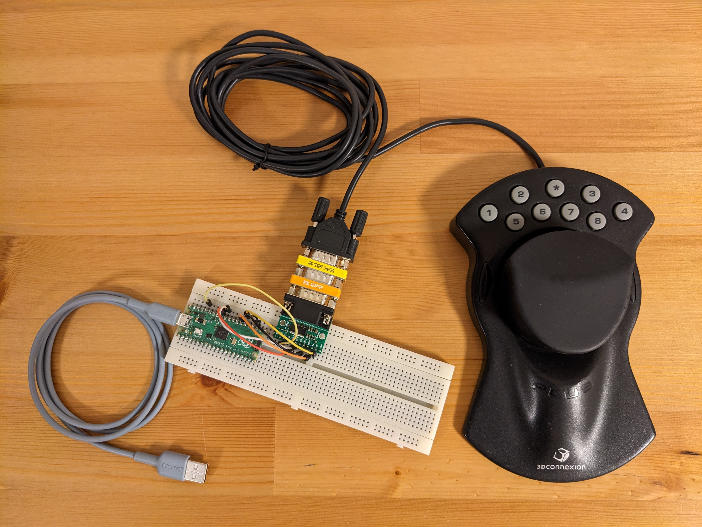

# RS-232 Magellan/SpaceMouse with modern software



This project lets you use an old serial Magellan/SpaceMouse controller with modern software on modern operating systems. It simulates a 3DConnexion SpaceMouse Pro, so it can be used with software like Fusion 360, 3ds Max, SolidWorks, Inventor, Maya and many others. No special software is required on the computer, apart from 3DxWare. From the computer's point of view, your old Magellan will look like a real SpaceMouse Pro connected over USB.

To make it work you will need:

- Raspberry Pi Pico
- [Pololu 23201a Serial Adapter](https://www.pololu.com/product/126)
- null modem adapter and DB9 gender changer (either as two separate adapters or one that does both)
- breadboard and some jumper wires

Make the following connections between the Pico and the serial adapter:

| Pico | serial adapter |
| -----: | ------ |
| 3V3 (pin 36) | VCC |
| GND (pin 23) | GND |
| GPIO20 (pin 26) | RX |
| GPIO21 (pin 27) | TX |
| GPIO26 (pin 31) | RTS |
| GPIO27 (pin 32) | CTS |

Flash the Pico with the [magellan.uf2](magellan.uf2) firmware the usual way: hold the BOOTSEL button while connecting the board to the computer, then copy the UF2 file to the USB drive that shows up.

Install 3DxWare on your computer and enjoy.

Buttons on the Magellan (`1`, `2`, `3`, `4`, `5`, `6`, `7`, `8`, `*`) are mapped to the following buttons on the emulated SpaceMouse Pro: `1`, `2`, `3`, `4`, `Esc`, `Ctrl`, `Alt`, `Shift`, `Menu`. You can assign functions to them in 3Dconnexion's software. The two buttons to the left and right of the puck are the same as buttons `6` and `7`.

## How to compile the firmware

```
git clone https://github.com/jfedor2/magellan-spacemouse.git
cd magellan-spacemouse
git submodule update --init
mkdir build
cd build
cmake ..
make
```
